Uzun süredir üzerinde çalıştığım ilan paylaşım ve portfolyo platformu projemi başarıyla tamamlamış olmanın heyecanını yaşıyorum!  

Bu projeyle hem teknik becerilerimi geliştirdim hem de gerçek dünya kullanımına uygun bir çözüm üretmeyi hedefledim.

---

## 🔍 Proje Özellikleri

### ✅ Kullanıcı Girişi
- Kullanıcılar kayıt olabilir ve giriş yapabilir.
- Güvenli bir şekilde oturum yönetimi sağlanır.

### ✅ İlan Paylaşımı & Yönetimi
- Kullanıcılar kendi ilanlarını paylaşabilir, düzenleyebilir ve silebilir.
- Kategorilere ve alt kategorilere göre filtreleme yapılabilir.

### ✅ Portfolyo Yönetimi
- Kullanıcılar unvan, iletişim bilgileri, uzmanlık alanları, eğitim geçmişi ve sertifikalarını ekleyebilir veya güncelleyebilir.

### ✅ Arama & Filtreleme
- İlanlar üzerinde anahtar kelime ile arama yapılabilir.
- Kategoriye göre filtreleme uygulanabilir.

### ✅ Gerçek Zamanlı Mesajlaşma (Socket.io)
- İlanlara özel kişisel mesajlaşma imkânı.
- Kullanıcıya özel anlık bildirim sistemi.

### ✅ Kullanıcı Deneyimi & Doğrulama
- Boş alan kontrolleri ve input validasyonları.
- Kullanıcı odaklı geri bildirimler ile form deneyimi geliştirilmiştir.

---

## ⚙️ Kullanılan Teknolojiler

**Frontend:** React.js, Context API, Tailwind CSS, FontAwesome  
**Backend:** Node.js, Express.js  
**Gerçek Zamanlı İletişim:** Socket.io  
**HTTP İletişimi:** Axios  
**Depolama & Oturum:** LocalStorage  
**Yardımcı Araçlar:** useMemo, useRef gibi ileri seviye React Hook’ları  
**Güvenlik:** Authentication & Authorization sistemleri

---

## 💡 Projede Amaçladıklarım
- Temiz ve sürdürülebilir kod yapısı kurmak  
- Kullanıcı merkezli arayüzler geliştirmek  
- Gerçek zamanlı etkileşimleri başarıyla entegre etmek  
- Full-stack yetkinliğimi geliştirmek ve sektöre katkı sağlamak

---

## Arayüzler

  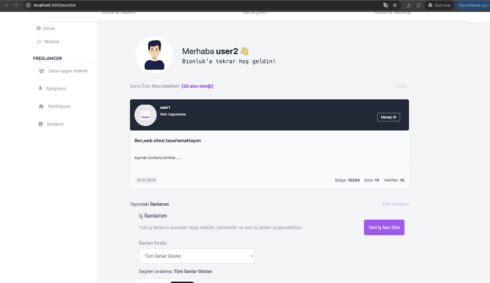

  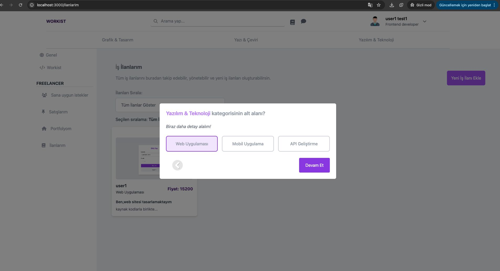

  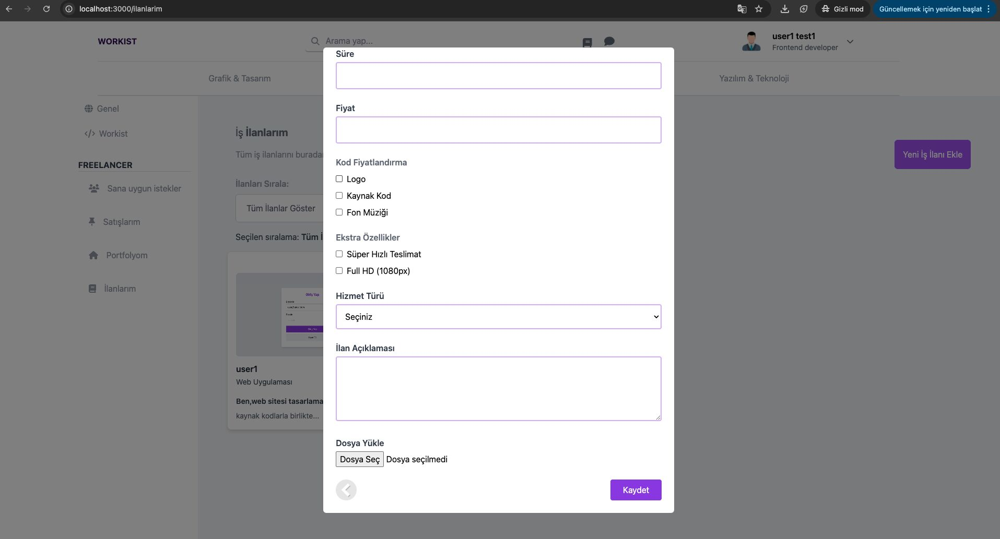

  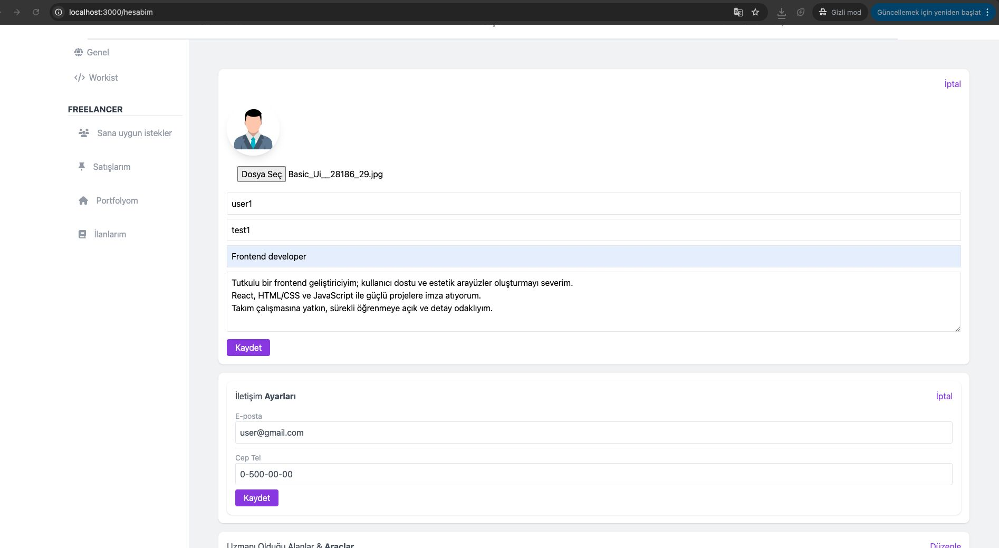

  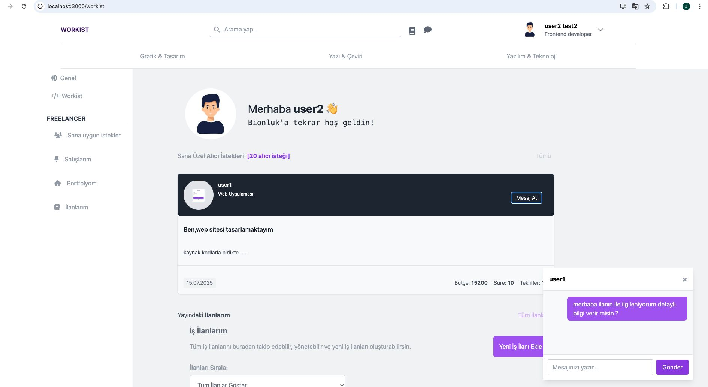

  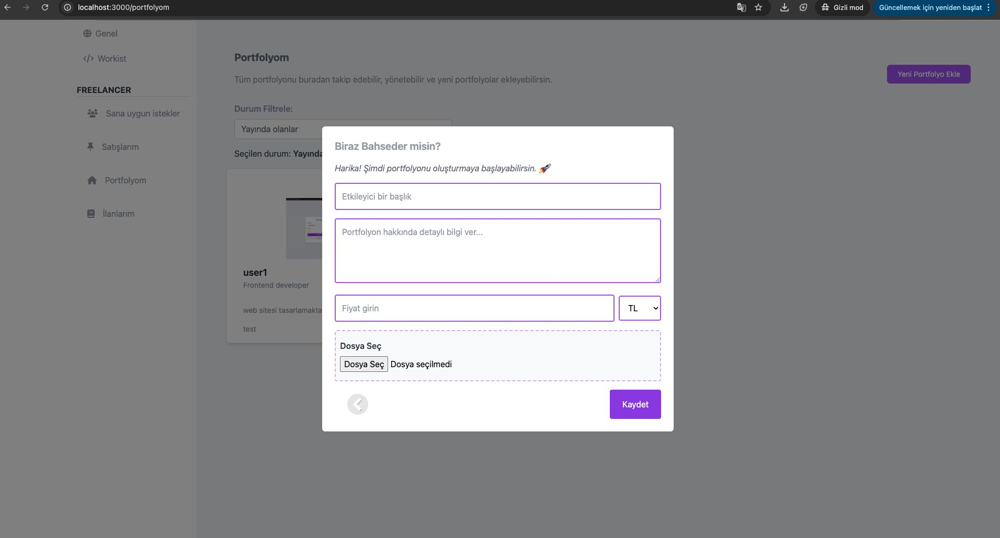

  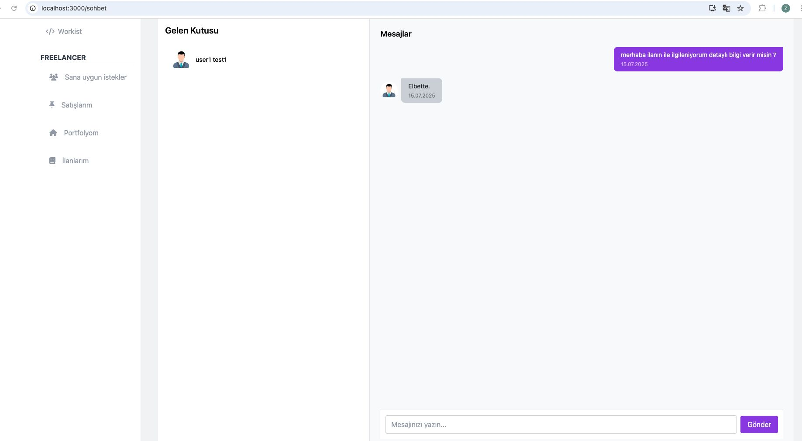

  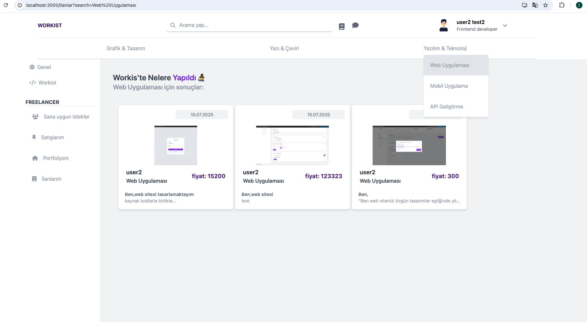

  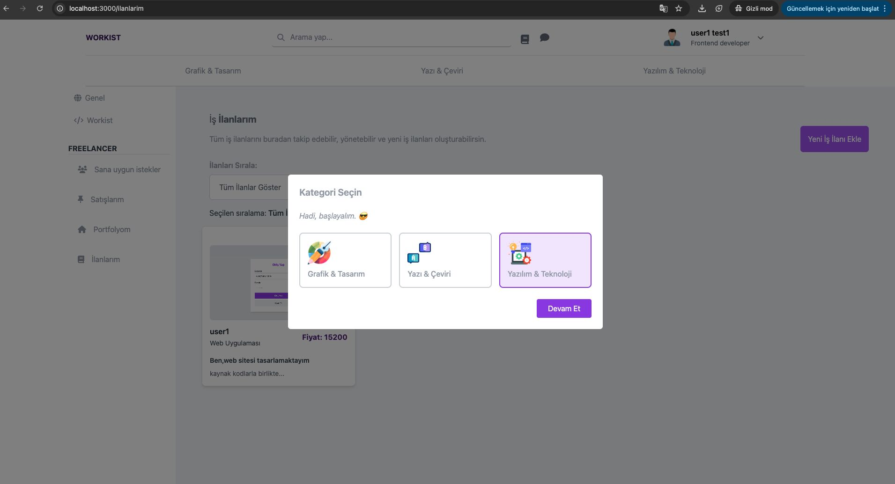

  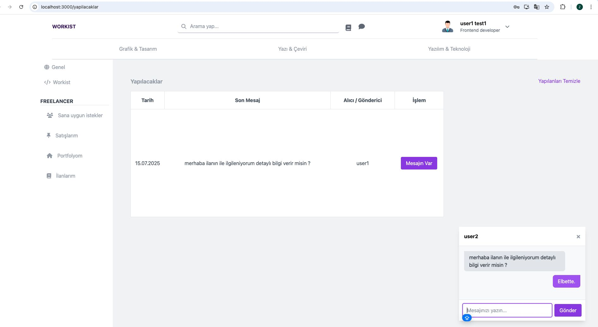

  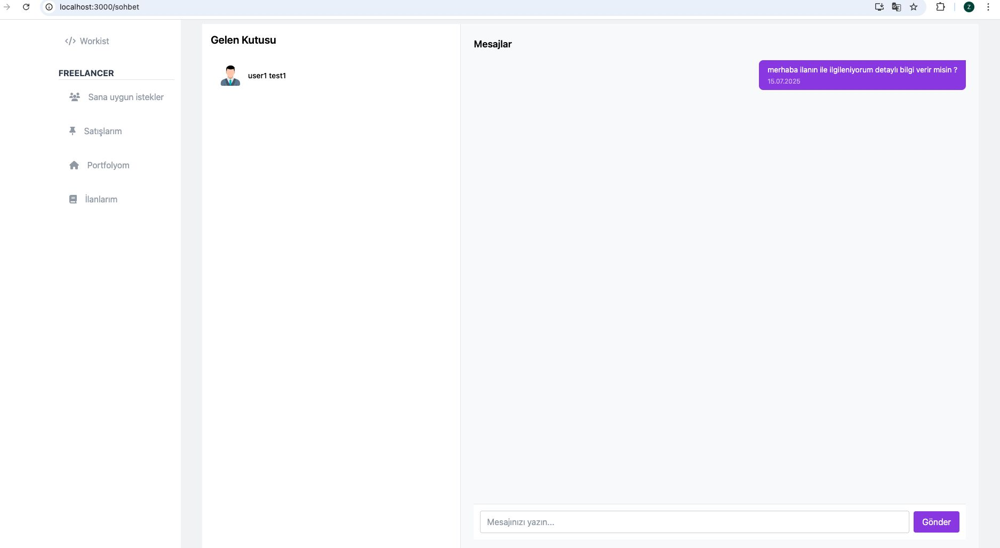

  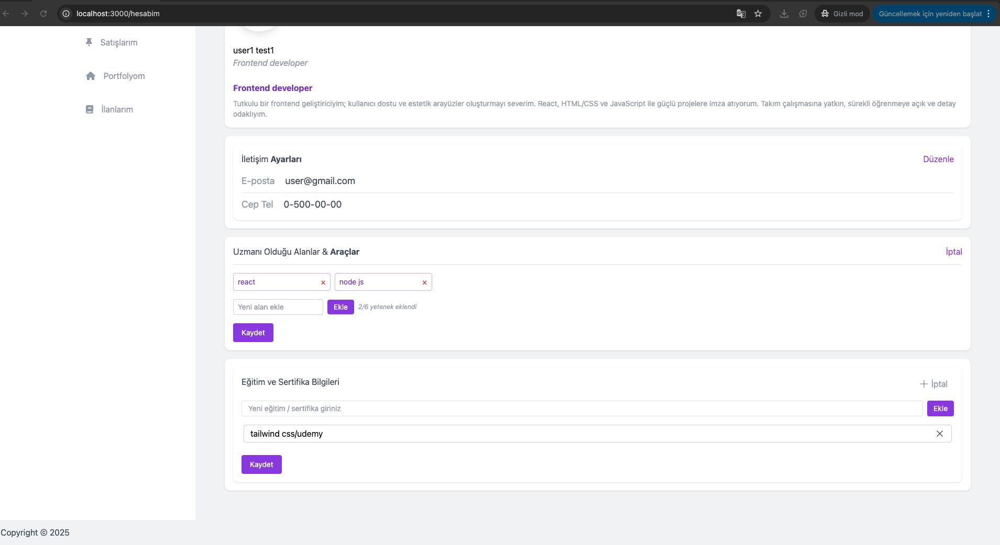

  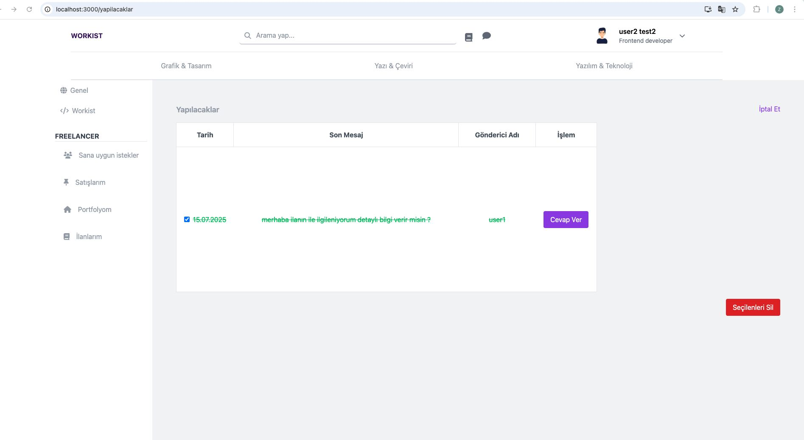

  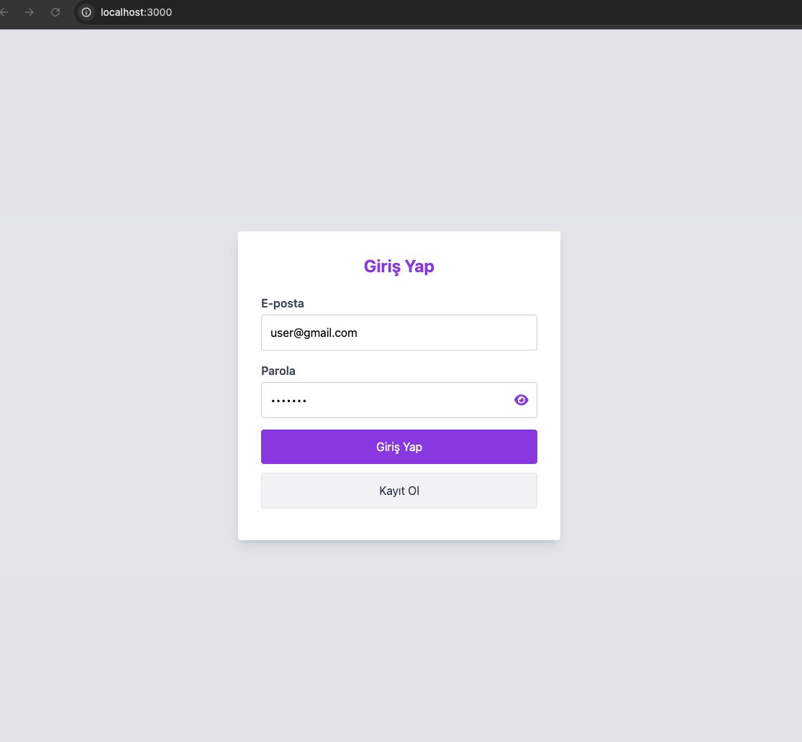

  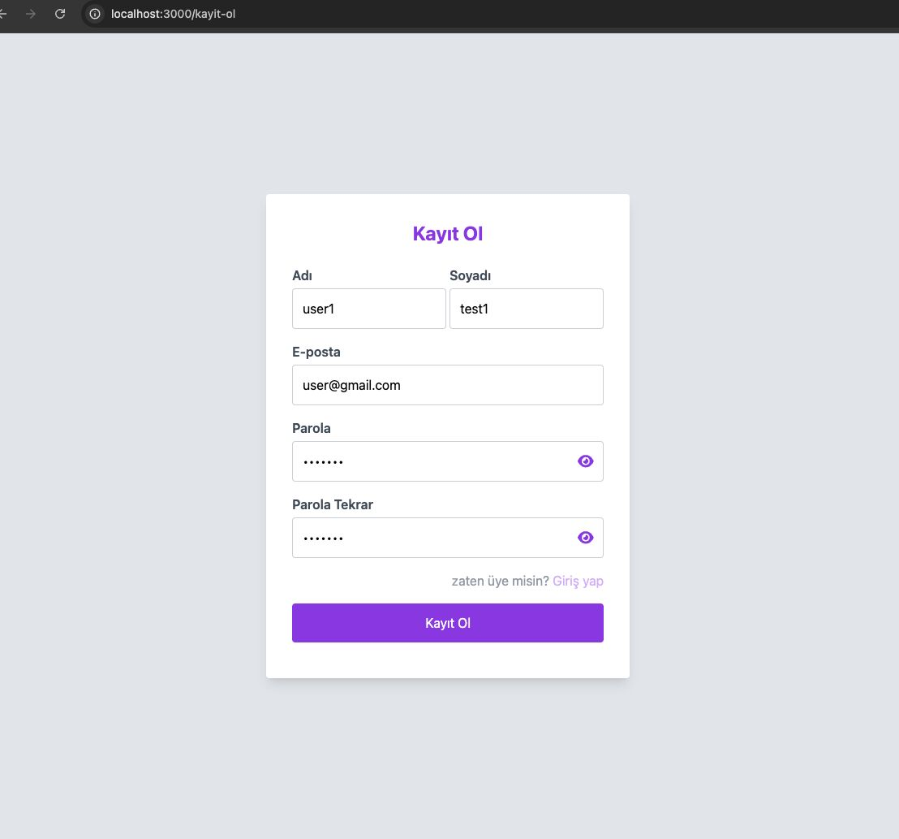

