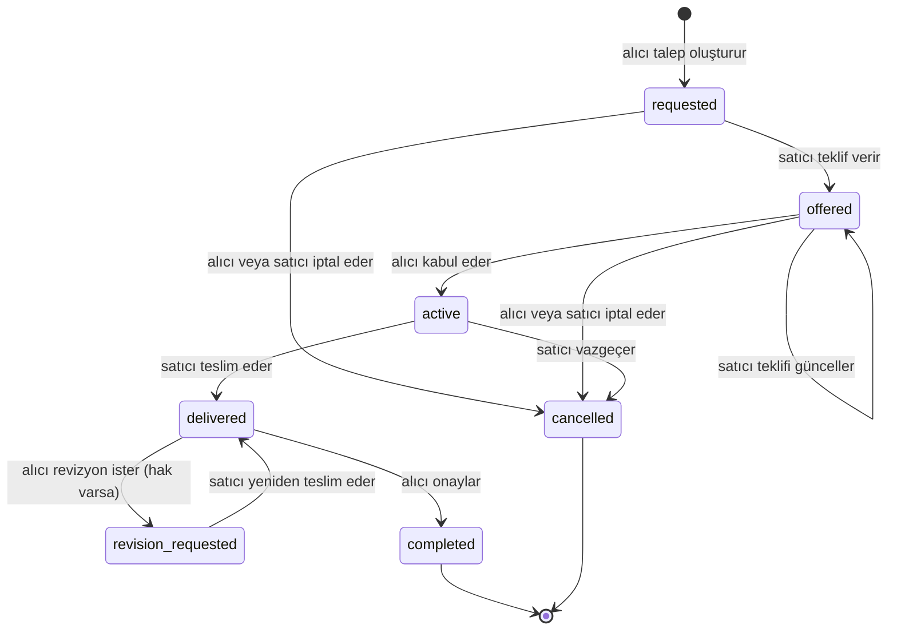

# 0004 — Sipariş durum makinesi

**Durum:** Kabul edildi

## Karar

Geçişler tek bir tabloda (`server/services/orderStateMachine.js`) tanımlıdır; servis katmanı her işlemde bu tabloya sorar. Rol her zaman token'daki kullanıcının siparişteki yerinden (`buyer`/`seller`) türetilir.

- Revizyon hakkı sipariş anındaki ilanın `revisionCount` değeridir (`revisionLimit`).
- Kabulde `dueAt = şimdi + teklif.deliveryDays`.
- Her geçiş `events` dizisine `{action, actor, fromStatus, toStatus, note}` olarak yazılır; arayüzdeki zaman çizelgesi buradan üretilir.
- API her sipariş için `availableActions` döner; arayüz butonları buna göre gösterir, yetki kontrolü yine sunucudadır.
- Hatalar: geçersiz geçiş `409 INVALID_TRANSITION`, yanlış rol `403 FORBIDDEN`, hak bitti `409 REVISION_LIMIT_REACHED`. Siparişin tarafı olmayan kullanıcı siparişi hiç göremez (`404`).
- Değerlendirme yalnızca `completed` siparişte, yalnızca alıcı tarafından, bir kez yapılabilir. İlan ve satıcı puan ortalaması aggregation ile yeniden hesaplanır.

## Sonuçlar

- Ödeme/escrow yok; `completed` yalnızca iş akışının bittiğini gösterir.
- Otomatik zaman aşımı (ör. teslimden 3 gün sonra otomatik onay) yok; eklenirse aynı tabloya bir zamanlayıcı aksiyonu olarak girer.
